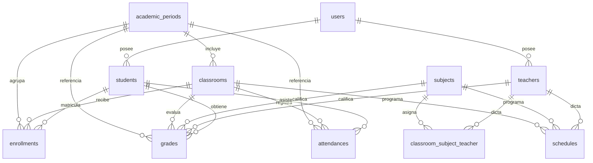

# Diagrama Entidad-Relación

```mermaid
erDiagram
    users ||--o{ students : posee
    users ||--o{ teachers : posee
    academic_periods ||--o{ classrooms : incluye
    academic_periods ||--o{ enrollments : agrupa
    academic_periods ||--o{ grades : referencia
    academic_periods ||--o{ attendances : referencia
    classrooms ||--o{ enrollments : recibe
    classrooms ||--o{ schedules : programa
    classrooms ||--o{ attendances : registra
    classrooms ||--o{ grades : evalua
    subjects ||--o{ grades : califica
    subjects ||--o{ schedules : programa
    subjects ||--o{ classroom_subject_teacher : asigna
    teachers ||--o{ classroom_subject_teacher : dicta
    teachers ||--o{ schedules : dicta
    teachers ||--o{ grades : califica
    students ||--o{ enrollments : matricula
    students ||--o{ grades : obtiene
    students ||--o{ attendances : asiste
```
